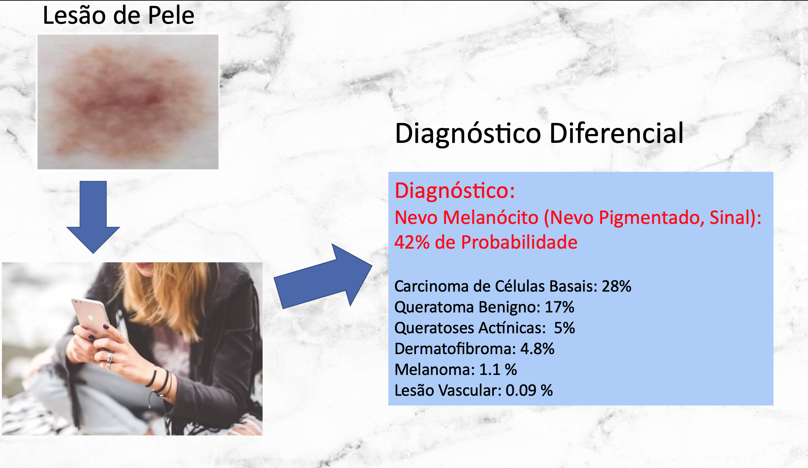

# Detecção de doenças de pele utilizando CNN   (Redes Neurais Convolucionais) - V0.1 -  Novembro, 2019   

Dataset = 12.000 imagens  
Imagens - 6 GB  
Uso de GPU para treinar o modelo    

Há, literalmente, milhares de doenças cutâneas específicas. Abordaremos nesta pesquisa, onze classes de doenças de pele que abrangem mais de 95% de todos os distúrbios de pigmentação diagnosticados diariamente na prática clínica (ROBBINS & COTRAN, 2010; TSCHANDL ET AL., 2018; ZALAUDEK ET AL, 2012; HABIF, 2012; WILDER-SMITH & BAKEL, 2008; WHO, 2019; LU ET AL., 2017).

## O objetivo do aplicativo é, Registrar por fotos uma lesão de pele, Detectar e Auxíliar no diagnóstico diferencial.

Doenças de Pele: 
1. Acne *
2. Melanoma
3. Psoríase *
4. Dermatites (de contato, atípica) *
5. Queratose Actínica (devido à radiação solar)
6. CBC - Carcinoma Baso-Celular
7. Nevo Melanócito (Nevo Pigmentado, Sinal)
8. Dermatofibroma (Histiocitoma Fibroso Benigno)
9. Queratose Actínica
10. Lesões de pele Vasculares
11. Queratoses Seborréicas

(*) Distúrbios de pele mais comuns no Brasil, segundo Dermatologistas e Epidemiologistas.  

# Referências

BRASIL. Ministério da Saúde. Saúde Brasil 2010: uma análise da situação de saúde e de evidências selecionadas de impacto de ações de vigilância em saúde. Brasília, DF, 2011.  

HABIF, T. P. Dermatologia clínica: guia colorido para diagnóstico e tratamento - tradução de Maria Inês Correa Nascimento et.al. 5. ed. Rio de Janeiro: Elsevier, 2012.

LU, LE; ZHENG, YEFENG;  CARNEIRO, GUSTAVO;  YANG, LIN. Deep Learning and Convolutional Neural Networks for Medical Image Computing: Precision Medicine, High Performance and Large-Scale Datasets (Advances in Computer Vision and Pattern Recognition).  Ed Springer; 1st ed. 2017 edition . 326 pages.  New York City, USA. 2017.

TALHARI, S.; ANDRADE, A.R.C.; RAMOS, A.M.C.; TALHARI, C.; BRAGA, B.; GONÇALVES, H.S. Manifestações cutâneas e diagnóstico diferencial. In: Hanseníase. 5. ed. Manaus: Di Livros, 2015, cap. 3, p. 17- 43.

TSCHANDL, PHILIPP; ROSENDAHL , CLIFF; KITTLER, HARALD. The HAM10000 dataset, a large collection of multi-source dermatoscopic images of common pigmented skin lesions. Sci. Data 5, 180161 doi:10.1038/sdata.2018.161. New York. United States. 2018.

ROBBINS, STANLEY; COTRAN, RAMZI S. Patologia - Bases Patológicas das Doenças. Ed Elsevier. 8a edição. Rio de Janeiro. RJ. 2010.

WHO. World Health Organization. Neglected tropical diseases. Disponível: http://www.who.int/neglected_diseases/diseases/en/. Acesso 17 out. 2019.

WHO. World Health Organization. Weekly epidemiological record Relevé épidémiologique hebdomadaire, v. 88, n. 35, p. 365-380, 2013.

WILDER-SMITH, E.; BAKEL, V. Nerve demage in leprosy and its menagement. Nature Clinical Pratice – Neurology, v. 4, n. 12, p. 656-663, 2008.

ZALAUDEK, I. ET AL. Dermatoscopy of facial actinic keratosis, intraepidermal carcinoma, and invasive squamous cell carcinoma: a progression model. J. Am. Acad. Dermatol. 66, 589– 597. 2012.

